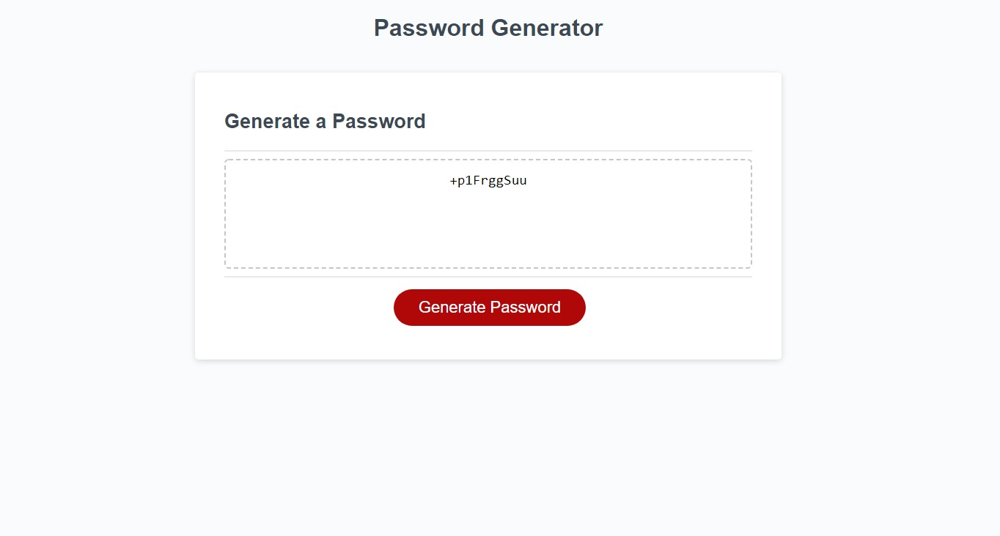

## Random Password Generator

# About
This program is a random password generator used to create a password based on a number of user inputs. These inputs dictate how your password will be formed.

# Using the program
When opening the page, you will be greeted with a blank box, as well as a "Generate Password" button. Click the button to begin the process of creating your password.
* The first prompt will ask you how long you'd like your password to be. Enter any number as low as eight(8) and as high as one hundred and twenty-eight(128). Entering any number too high, too low, or responding in any way that isn't a number within that range, will give you an error and redirect you to the beginning of the process.
* The next series of prompts will dictate which type of characters will be used in the password that will be generated for you. On each prompt, click "OK" to include them, or "CANCEL" to have them excluded. You must choose at least one of these types. Clicking "CANCEL" on all prompts will result in an error, and will redirect you to the beginning of the process. 
* Types of characters: Uppercase letters, lowercase letters, numbers, and symbols/special characters.

# Link to deployed aplication
Click [here](https://auscarter17.github.io/Password-Generator/) to be taken to the site.
Click [here](https://github.com/auscarter17/Password-Generator.git) to be taken to the GitHub repository for the program.

